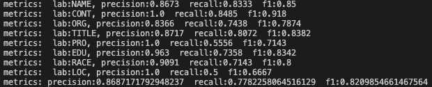

# LM_NER

## Info
基于Pytorch的命名实体识别/信息抽取框架，支持LSTM+CRF、Bert+CRF、RoBerta+CRF等模型。

模型能解决flat ner问题（非嵌套命名实体识别问题）。

同时支持中英文的数据集的实体识别任务。


## Requirement
```
    python3.6
    numpy==1.19.5
    pandas==1.1.3
    torch==1.3.0
    transformers==4.6.1
```
可通过以下命令安装依赖包
```
    pip install -r requirement.txt
```

## Datasets
* **CNER**
    * 来自：https://github.com/lonePatient/BERT-NER-Pytorch
    * 关于简历的的数据。
    * 数据分为8类标签类别，分别为：
    ```
        国家（CONT）
        民族（RACE）
        姓名（NAME）
        组织（ORG）
        地址（LOC）
        专业（PRO）
        学历（EDU）
        职称（TITLE）
    ```
* **CLUENER（待补充）**
    * 来自：https://github.com/CLUEbenchmark/CLUENER2020
    * 数据来源于Sina News RSS.
    * 数据分为10个标签类别，分别为: 
    ```
        地址（address）
        书名（book）
        公司（company）
        游戏（game）
        政府（government）
        电影（movie）
        姓名（name）
        组织机构（organization）
        职位（position）
        景点（scene） 
    ```

* **加入自己的数据集**
    * 可使用本项目的处理方式，将数据集切分为3部分：train/valid/test，其中token和label之间用空格分割。
    * 数据使用BIO的标注方式。
    * 在 ./dataset 目录下新建一个文件夹，并把3个数据文件放置新建文件夹下。
    * 处理好数据集后，需要修改文件 arg_config.py 中的变量，英文为'en'，中文为'zh'。
    ```
        self.language = 'en'
    ```

* **数据集示例**
    * 以数据集CNER为栗子，文本和标签使用空格隔开，采用以下形式存储：
    ```
        2 O
        0 O
        1 O
        3 O
        年 O
        2 O
        月 O
        至 O
        今 O
        任 O
        广 B-ORG
        东 I-ORG
        X I-ORG
        X I-ORG
        X I-ORG
        X I-ORG
        X I-ORG
        X I-ORG
        股 I-ORG
        份 I-ORG
        有 I-ORG
        限 I-ORG
        公 I-ORG
        司 I-ORG
        董 B-TITLE
        事 I-TITLE
        、 O
        ...
    ```


## Model
项目目前支持以下模型：
* LSTM + CRF
* Bert + CRF
* RoBerta + CRF


## Get Started
### 1. 训练
准备好训练数据后，终端可运行命令
```
    python3 run.py
```
### 2 评估（待补充）
加载已训练好的模型，并使用valid set作模型测试，输出文件到 ./dataset/${your_dataset}/output.txt 目录下。

需要修改config文件中的变量值，并保存。

(本人不喜欢使用argparse等模块传入参数，尽管使用上会比较便利，但个人感觉太乱。同样想要修改其他参数，可以直接在arg_config.py中修改)

```
    self.mode = 'eval'
```
终端可运行命令
```
    python3 run.py
```

### 3. 预测（待补充）
预测未知标签数据集，并保存为文件 ./dataset/${your_dataset}/output.txt 目录下。

需要修改config文件中的变量值，并保存。

```
    self.mode = 'test'
```
终端可运行命令
```
    python3 run.py
```

## Result
模型预测结果示例如下：

指标情况


测试集


## FAQ
1. 训练过程报错 ValueError: Connection error, and we cannot find the requested files in the cached path. 
    * 网络问题，原因是与huggingface服务器断开，预训练模型下载失败了，重跑一次，一次不行再来一次~


## Reference
【LSTM+CRF】https://arxiv.org/pdf/1603.01360.pdf

【Bert】https://arxiv.org/pdf/1810.04805.pdf

【RoBerta】https://arxiv.org/pdf/1907.11692.pdf

【Github:BERT-NER-Pytorch】https://github.com/lonePatient/BERT-NER-Pytorch

【Github:transformers】https://github.com/huggingface/transformers


